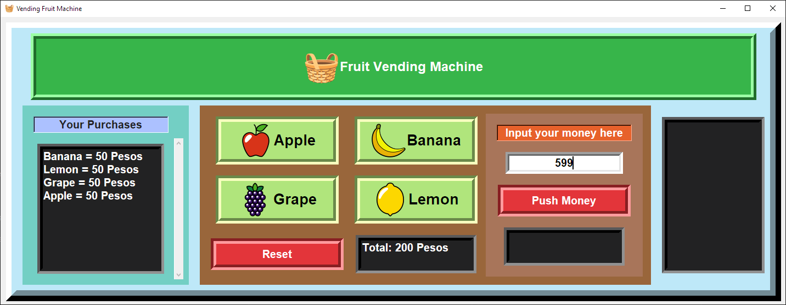

# Python Tkinter Vending Machine Simulation
----------
Welcome to the Python Tkinter Vending Machine Simulation! 🍏🍌🍊

##Overview
This project simulates the operation of a real-world vending machine where users can select and purchase fruits. It provides a graphical user interface (GUI) built using Python's Tkinter library, allowing users to interact with the vending machine easily.



## Features
- **Fruit Selection**: Users can view a list of available fruits and select the ones they want to purchase.
- **Payment**: The vending compute your payment and give a change if any.
- **User-Friendly Interface**: The GUI provides an intuitive interface for users to navigate and interact with the vending machine.

## Installation

To run the Python Tkinter Vending Machine Simulation locally, follow these steps:

1. **Clone the repository**:
    ```bash
    git clone https://github.com/yourusername/vending-machine.git
    ```

2. **Navigate to the project directory**:
    ```bash
    cd vending-machine
    ```

3. **Install dependencies** (if applicable):
    ```bash
    pip install -r requirements.txt
    ```

4. **Run the application**:
    ```bash
    python main.py
    ```

## Usage

1. Launch the application by running `VendingFruitMachine.py`.
2. Use the graphical interface to select fruits.
3. Input your payment.
4. Wait for your change.
5. Repeat transaction.

## Contributing

We welcome contributions from the community. To contribute:

1. Fork the repository.
2. Create a new branch (`git checkout -b feature-branch`).
3. Make your changes and commit them (`git commit -m 'Add some feature'`).
4. Push to the branch (`git push origin feature-branch`).
5. Open a Pull Request.

Please ensure your code adheres to our coding standards and includes relevant tests.

## Contact
For any questions, suggestions, or feedback, please contact me at:
- Email: airaestur@gmail.com
- Socials: linktr.ee/airaestur
